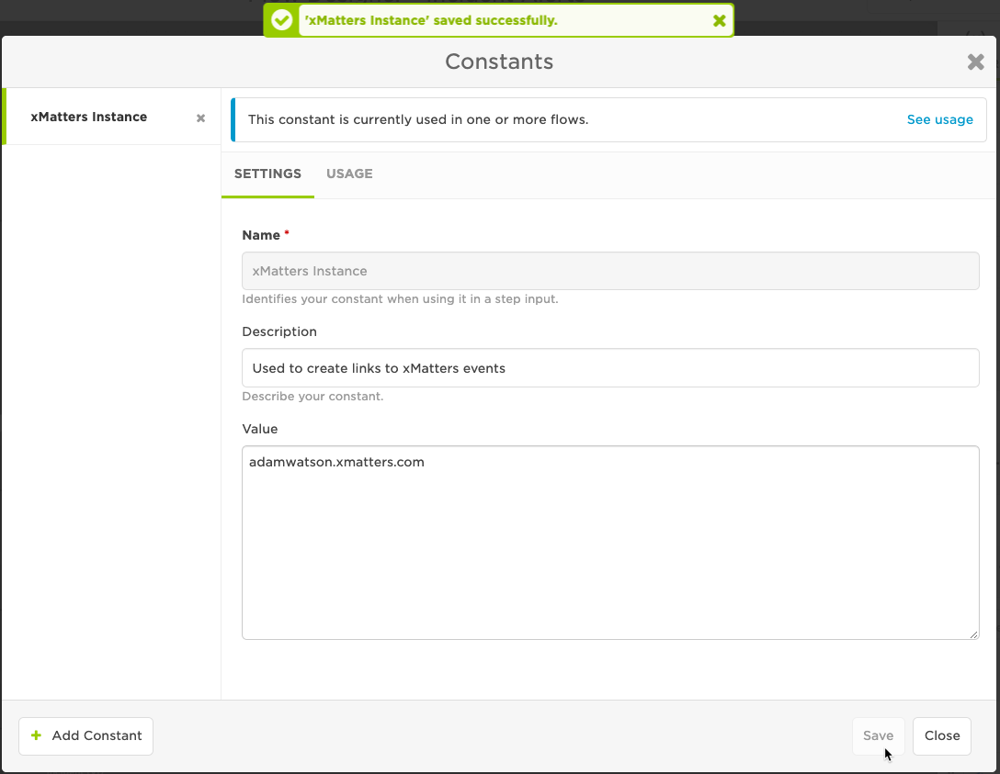

# TOPdesk
"TOPdesk's ITSM tool is an easy way to automate your ITSM processes. Increase efficiency, reduce costs, make your customers happy."

Here we allow two enhancements with xMatters :
* A quick and easy integration to notify groups and users when TOPdesk tickets are created or are changed.
* Two easy steps for xMatters Flow Designer that update and add action comments to tickets.

These are arranged out of the box in an integration that you can choose to use as is or modify and expand.

<kbd>
  
</kbd>

# Pre-Requisites
* [A TOPdesk instance](https://www.topdesk.com/uk/itsm-software/)
* xMatters account - If you don't have one, [get one](https://www.xmatters.com)!

# Files
* [TopDesk.zip](TopDesk.zip) - The xMatters workflow zip for TOPdesk.

# How it works
The real value in this importable workflow is the custom steps that come with it and allow you build your own process with xMatters and TOPdesk.  However, the workflow also comes with a fairly standard prebuilt workflow that demonstrates some of what is possible and could be your test bed or the beginning of your process. This is a description of that out of the box process.

## Inbound to xMatters

When a ticket change or creation matches a configured Event in TOPdesk the xMatters Action fires to a TOPdesk HTTP Trigger in xMatters Flow Designer.  This starts a flow that ends any existing events for the ticket and, depending on the ticket processing status, notifies the assigned Operator which may be a group in xMatters.

## Response back to TOPdesk

Notified xMatters users can respond "Acknowledge", "Escalate" and "Complete".
* Responding "Acknowledge" will trigger an xMatters flow that will assign the TOPdesk ticket to the responder and change the ticket status to Acknowledged.
* The "Escalate" response simply tells xMatters to skip the current wait in the group and go to the next person on call. This response is logged in the TOPdesk ticket.
* Responding "Complete" will set the ticket Closer Code and change the Processing Status to Completed.

## Comments create actions in TOPdesk

Mostly comments are made when responding, but it is possible to make comments outside of this.  For that reason we need a separate trigger for the adding of comments.  When comments are added to the xMatters event we add them to the TOPdesk ticket as actions.

# Installation

## TOPdesk User setup

You will need to create a user in TOPdesk for xMatters to make updates as.

The user must be an operator that has permission to edit First Line and Second Line calls.

Any action notes put into the ticket will show as authored by this user so you may want to use [this icon as the users image](xmatters_icon.png).

One you have your user setup get an **Application Key** for it ***how?***.  You'll need to use the **Login Name** and **App Key** when setting up the [Endpoint in xMatters](xMatters set up) and when creating the Action Sequences in TOPdesk.

## xMatters set up
1. Login to xMatters, navigate to the Workflow tab and import the [TopDesk.zip](TopDesk.zip) workflow. Details [here](https://help.xmatters.com/ondemand/xmodwelcome/workflows/manage-workflows.htm#ImportExport)

1. Click on the **TOPdesk** workflow and then click the Flows tab. Click on the **Incident Alerts** canvas and then double click the **Incident Alerts - TOPDesk New Incident** HTTP inbound step which is at the beginning of the first flow in the canvas.

1. In the **Authentication** section you'll see yourself listed. If you're happy for the flow to run as you this can be left like this, for a production release I'd recommend creating a TOPdesk user for the flow to run as.  To have the flow run as a different xMatters user select that user here.  Make sure the user has sender permission on the from in this workflow.

1. Copy the URL in the **Initiation** section and keep it for future reference, you'll need it in **TOPdesk set up #?**.  Please note that this URL has a key that denotes the user that will run the flow, so make any changes in the **Authentication** section first, and then copy this URL.

1. Back on the canvas select **Constants** from the **Components** menu (top right).  We need to tell the integration where xMatters is so that it can create deep links to xMatters events to be put in TOPdesk actions.  In the Constant **xMatters Instance** change the **Value** to the hostname of your xMatters instance,  this will be something like   *mycompanyname.xmatters.com*

1. Again in the **Components** menu back on the canvas, now select **Endpoints**
There is one endpoint here which is your TOPdesk instance.  I recommend creating an xMatters account in TOPdesk which will make all the updates to tickets, see **TOPdesk User setup**.  Once the account is created create an App Key for it.  In the endpoint here add your TOPdesk URL, username of the account and the App Key as the password.

## TOPdesk Action Sequence set up
Action Sequences tell TOPdesk how to instruct xMatters that there is an important change to an incident.

1. In the Action Explorer in TOPdesk, create a new **First Line Call**, **Action Sequence** in TOPdesk.

1. Click **Import** and import the settings from [xMatters - First Line Incident WebHook - v1.0.json](xMatters - First Line Incident WebHook - v1.0.json)

1. The action needs to get extra deatils about the incident from the TOPdesk API so we need to fill in some details in the veriables section to help it:

 * The variable **TOPdesk_Domain** needs to be the name of your TOPdesk instance. This is whatever is in your browser after `https://` and before the next `/`, like *mycompanyname.topdesk.net*
 * The variable **TOPdesk_Domain** should be the login name of the xMatters user you have created in TOPdesk.
 * **TOPdesk_ApiKey** is the Application Key you have created for this user.

1. Now find the **URL** property of **Step 2**, it will currently be set to `Your HTTP Trigger URL Here`.  Replace that text with the full URL you copied out of the *Initiation* section from the *Incident Alerts - TOPDesk New Incident* HTTP trigger in xMatters Flow Designer.

1. Click save

1. Now create a new **Second Line Call**, **Action Sequence** and do it all again with [xMatters - Second Line Incident WebHook - v1.0.json](xMatters - Second Line Incident WebHook - v1.0.json). Use the same xMatters Trigger URL.

## TOPdesk Event set up(s)

While Action Sequences say what to do, Events tell TOPdesk when to instruct xMatters it might need to do something. I suggest 4 event configuration looking for when:

 1. **First Line Calls**, Type: **New Card**
 1. **First Line call**, Type: **Edit Card**
 1. **Second Line call**, Type: **New Card**
 1. **Second Line call***, Type: **Edit Card**

For ***all*** events add a **Condition** :
 * **Suppress event when** the **Changer of the Card equals** the xMatters user.

For ***Edit card*** event types add **Edit Specifications** :
 * **Event occurs with any edit**:
  * *Field*: **Status**, *Old value*: **No specific value**, *New value*: **No specific value**
  * *Field*: **Operator**, *Old value*: **No specific value**, *New value*: **No specific value**

For ***all*** events, link to the Action Sequences you created above.

I don't make it much more complicated than that.  Let xMatters deal with validating the Incident Status is one you're sending events for or the current assignee is one that can get xMatters notifications.

# Testing
You're done!

Find an Operator Group that exists in TOPdesk that you are in.  Create a group in xMatters with the same name and put yourself in that group.  Make sure your login name in TOPdesk matches your username in xMatters.  Then assign a ticket to that group in TOPdesk, people in that group in xMatters will receive a notification, responding "Acknowledge" will assign the ticket to you in TOPdesk and set the Processing Status to "Acknowledged".

# Troubleshooting

# To Come

* Create TOPdesk incident step
